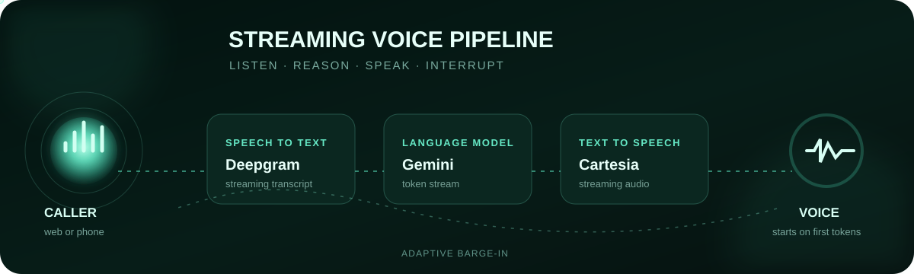
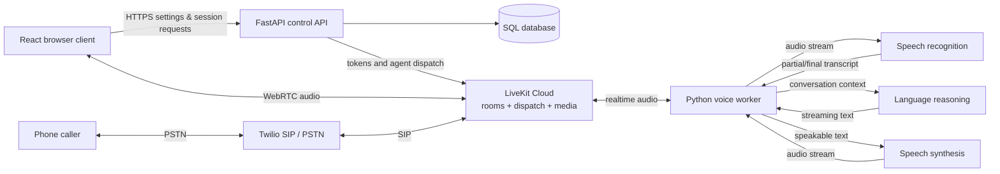
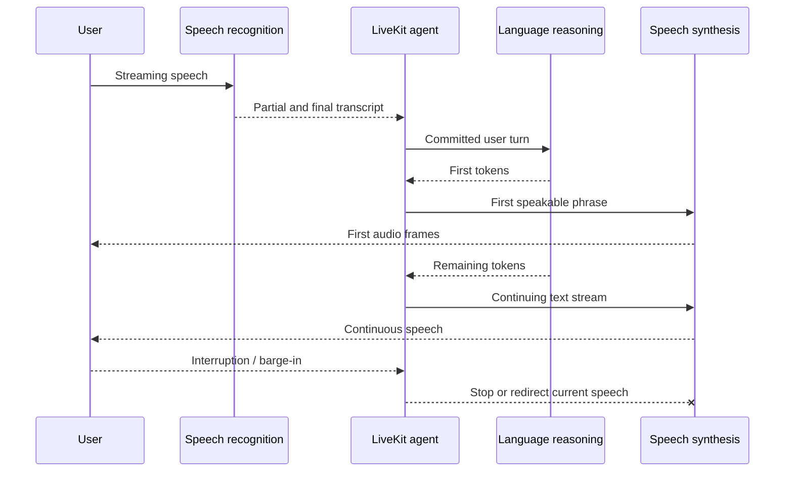

<p align="center">
  
</p>

<h1 align="center">Full-Duplex Hotel Voice Agent</h1>

<p align="center">
  A low-latency browser and phone assistant for natural hotel conversations, realtime settings, and outbound calling.
</p>

<p align="center">
  
  
  
  
  
</p>

> [!IMPORTANT]
> This project uses a fast, streaming voice pipeline. The README intentionally describes the system architecture without exposing private runtime choices.

## Contents

- [What the project does](#what-the-project-does)
- [Architecture](#architecture)
- [Runtime components](#runtime-components)
- [Project structure](#project-structure)
- [Prerequisites](#prerequisites)
- [Installation](#installation)
- [Environment configuration](#environment-configuration)
- [Run the application](#run-the-application)
- [CI/CD](#cicd)
- [Docker deployment on a GCP VM](#docker-deployment-on-a-gcp-vm)
- [Use the application](#use-the-application)
- [Outbound phone calls](#outbound-phone-calls)
- [API reference](#api-reference)
- [Realtime behavior](#realtime-behavior)
- [Testing and quality checks](#testing-and-quality-checks)
- [Troubleshooting](#troubleshooting)
- [Security and production notes](#security-and-production-notes)

## What the project does

This repository contains a complete hotel voice-assistant application rather than only an agent script. It supports browser conversations, inbound or outbound SIP calls, configurable agent behavior, persistent settings, synchronized transcripts, and interruption-aware streaming speech.

| Capability | Current behavior |
| --- | --- |
| Browser voice | The React client publishes microphone audio and receives agent audio over LiveKit WebRTC. |
| Phone voice | LiveKit SIP connects the worker to Twilio and the public telephone network. |
| Fast first audio | The assistant can start speaking before the full answer is finished. |
| Barge-in | The microphone remains active while the assistant speaks, allowing the caller to interrupt. |
| Turn detection | VAD, LiveKit turn prediction, dynamic endpointing, and false-interruption handling coordinate turns. |
| Speech input | Streaming speech recognition turns caller audio into transcripts. |
| Speech output | Streaming speech synthesis returns natural voice audio. |
| Noise control | Automatic gain control and AI-coustics enhancement clean microphone input. |
| Hotel workflow | The prompt covers reservations, rooms, amenities, policies, directions, and guest requests. |
| Repetition control | The runtime tracks recent turns, avoids duplicate questions, and asks for clarification when audio is unclear. |
| Call completion | Deterministic closing logic plays the goodbye before ending a dedicated phone room. |
| Agent settings | Name, voice, language, personality, speaking pace, and instructions are editable in the UI. |
| Outbound dialer | Users select a country, enter a local number, and send an E.164 call request through FastAPI. |
| Persistence | FastAPI stores users, agents, settings, and voice-session snapshots through async SQLAlchemy. |

## Architecture



FastAPI is the **control plane**: it authenticates application requests, stores configuration, creates LiveKit tokens, and starts outbound dispatches. It does not proxy realtime audio.

LiveKit is the **media plane**: browser or SIP audio travels through the LiveKit room directly to the worker. Keeping media away from FastAPI avoids an unnecessary network hop.

### Streaming response path



The reasoning and speech systems overlap in time:

```text
First short text chunk appears ──► speech synthesis starts
More text keeps streaming ───────► voice audio continues preparing
First audio frames are ready ────► agent starts speaking
Remaining audio keeps streaming ─► no wait for the full answer
```

This reduces silence before an answer. Network latency, provider load, endpointing, and the length of the first speakable phrase still affect time-to-first-audio.

## Runtime components

| Layer | Implementation | Authentication path |
| --- | --- | --- |
| Web application | React 19, TypeScript, Vite, LiveKit Client SDK | Application bearer token + LiveKit participant JWT |
| Control API | FastAPI, Pydantic Settings, SQLAlchemy async | Server-side LiveKit credentials |
| Realtime orchestration | LiveKit Agents 1.7 | `LIVEKIT_URL`, `LIVEKIT_API_KEY`, `LIVEKIT_API_SECRET` |
| Speech recognition | Streaming recognition provider | Server-side speech credential |
| Language reasoning | Streaming reasoning provider | Server-side reasoning access |
| Speech synthesis | Streaming voice provider | Server-side voice access |
| Noise enhancement | LiveKit AI-coustics plugin | Runs in the worker pipeline |
| Telephony | LiveKit SIP outbound trunk + Twilio | LiveKit trunk configuration and optional Twilio REST credentials |
| Storage | SQLite by default | Local database URL |

Exact private runtime choices are configured in server-only environment variables and code, not documented here.

## Project structure

```text
voice_agent/
├── backend/
│   ├── __main__.py                 # `python -m backend` API launcher
│   ├── agent.py                    # worker launcher when cwd is backend/
│   ├── app/
│   │   ├── api/
│   │   │   ├── dependencies.py     # bearer auth and FastAPI dependencies
│   │   │   └── routes.py           # HTTP endpoints
│   │   ├── core/
│   │   │   ├── config.py           # typed backend environment settings
│   │   │   └── security.py         # API-token hashing and creation
│   │   ├── db/
│   │   │   └── session.py          # engine and database lifecycle
│   │   ├── main.py                 # FastAPI application factory
│   │   ├── repositories.py         # database access boundaries
│   │   ├── schemas.py              # validated request/response schemas
│   │   └── services.py             # users, agents, calls, and sessions
│   ├── voice_agent/
│   │   ├── __main__.py             # root-level worker module launcher
│   │   ├── worker.py               # LiveKit registration and SIP lifecycle
│   │   ├── session.py              # agent session, events, audio, greeting
│   │   ├── providers.py            # speech, reasoning, voice, VAD, turn handling
│   │   ├── prompts.py              # stable hotel conversation policy
│   │   ├── reservation.py          # reservation field extraction/state
│   │   ├── call_tools.py           # transfer and deterministic hang-up
│   │   ├── config.py               # per-call configuration and metadata
│   │   ├── state.py                # session state and resource ownership
│   │   └── persistence.py          # non-blocking FastAPI callbacks
│   ├── tests/                       # backend and voice-runtime tests
│   ├── requirements.txt            # runtime Python dependencies
│   ├── requirements-dev.txt        # lint, types, and test dependencies
│   └── ruff.toml                    # Ruff configuration
├── frontend/
│   ├── src/
│   │   ├── components/              # console, settings, transcript, dialer
│   │   ├── hooks/useVoiceSession.ts # LiveKit room and audio lifecycle
│   │   ├── api.ts                   # typed FastAPI client
│   │   ├── App.tsx                  # application state and orchestration
│   │   └── styles.css               # responsive minimal UI and animation
│   ├── package.json
│   ├── package-lock.json
│   └── vite.config.ts               # `/app/` base and API dev proxy
├── docs/
│   └── voice-agent-flow.svg         # animated README banner
├── .env.example                     # safe configuration template
└── README.md
```

Legacy examples under a `test/` directory are not part of the runtime. The application imports only the packages under `backend/app` and `backend/voice_agent`.

## Prerequisites

- Python 3.11.
- Node.js `20.19+` or `22.12+` and npm, as required by the installed Vite version.
- A LiveKit Cloud project with realtime voice-agent access.
- A server-side speech recognition credential.
- A microphone and speaker for browser/console testing.
- Optional: a LiveKit SIP outbound trunk and Twilio account for phone calls.

All commands below are PowerShell commands run from the repository root unless a section says otherwise.

## Installation

### 1. Create the Python environment

```powershell
python -m venv .venv
.\.venv\Scripts\Activate.ps1
python -m pip install --upgrade pip
python -m pip install -r backend\requirements.txt
```

If PowerShell blocks activation for the current process:

```powershell
Set-ExecutionPolicy -Scope Process -ExecutionPolicy Bypass
.\.venv\Scripts\Activate.ps1
```

### 2. Install the frontend

```powershell
Set-Location frontend
npm install
Set-Location ..
```

Use `npm ci` instead of `npm install` in CI when the lockfile is already up to date.

### 3. Create the private environment file

```powershell
Copy-Item .env.example backend\.env
```

Edit `backend/.env` and replace every required placeholder. Both FastAPI and the LiveKit worker load this same file.

## Environment configuration

### Minimum browser-voice configuration

```dotenv
LIVEKIT_URL=wss://your-project.livekit.cloud
LIVEKIT_API_KEY=your-livekit-project-key
LIVEKIT_API_SECRET=your-livekit-project-secret
LIVEKIT_AGENT_NAME=general-assistant

# Add private speech, reasoning, and voice credentials in backend/.env.

BACKEND_API_URL=http://127.0.0.1:8000
BACKEND_API_TOKEN=replace-with-a-long-random-private-value
DATABASE_URL=sqlite+aiosqlite:///./voice_agent.db
```

Generate a suitable internal callback token with Python:

```powershell
python -c "import secrets; print(secrets.token_urlsafe(48))"
```

Use the output only as `BACKEND_API_TOKEN`. This is not a LiveKit participant token.

### Environment reference

| Variable | Required | Purpose |
| --- | :---: | --- |
| `LIVEKIT_URL` | Yes | WebSocket URL for one LiveKit Cloud project; normally starts with `wss://`. |
| `LIVEKIT_API_KEY` | Yes | Server API key from the same LiveKit project. |
| `LIVEKIT_API_SECRET` | Yes | Server API secret paired with the key. |
| `LIVEKIT_AGENT_NAME` | No | Worker/dispatch name; defaults to `general-assistant`, and both processes must use the same value. |
| `DATABASE_URL` | No | Async SQLAlchemy URL; defaults to local SQLite. |
| `BACKEND_API_URL` | Recommended | FastAPI URL used by the worker for lifecycle callbacks. |
| `BACKEND_API_TOKEN` | Recommended | Shared private token protecting internal status callbacks. |
| Private speech credential | Yes | Server-side speech recognition credential used only by the worker. |
| Private reasoning setting | No | Server-side reasoning runtime setting used only by the worker. |
| Private voice setting | No | Server-side voice runtime setting used only by the worker. |
| `VOICE_AGENT_NAME` | No | Default assistant name used when metadata has no override. |
| `COMPANY_NAME` | No | Hotel or organization spoken in the greeting. |
| `AGENT_LANGUAGE` | No | Default locale, for example `en-US`. |
| `AGENT_TIMEZONE` | No | Timezone used to resolve dates such as “tomorrow.” |
| `AGENT_INSTRUCTIONS` | No | Hotel knowledge, boundaries, and task-specific behavior. |
| `AGENT_PERSONALITY` | No | Default personality selected for new agents. |
| `SPEAKING_SPEED` | No | Voice speed multiplier; the UI constrains it to `0.70–1.30`. |
| Response variation setting | No | Controls how focused or varied the assistant sounds. |
| `ENABLE_BACKGROUND_AUDIO` | No | Enables office ambience and quiet thinking sounds. |
| `AEC_WARMUP_SECONDS` | No | Echo-cancellation warm-up before normal interaction. |
| `NOISE_SUPPRESSION_LEVEL` | No | AI-coustics enhancement strength. |
| `SIP_OUTBOUND_TRUNK_ID` | Phone only | LiveKit outbound SIP trunk ID such as `ST_...`. |
| `HUMAN_TRANSFER_NUMBER` | No | E.164 destination used after an explicit transfer request. |
| `TWILIO_ACCOUNT_SID` | Trial/verification | Twilio account SID used by verification checks. |
| `TWILIO_AUTH_TOKEN` | Trial/verification | Twilio REST auth token; keep server-side only. |
| `TWILIO_PHONE_NUMBER` | Trial/verification | Twilio-owned caller number in E.164 form. |
| `TWILIO_TRIAL_MODE` | No | When `true`, FastAPI rejects outbound destinations Twilio has not verified. |

Supported voice-language families are Arabic, Danish, Dutch, English, French, German, Portuguese, Spanish, and Swedish. Unknown language codes fall back to English configuration.

> [!WARNING]
> Restart **both** FastAPI and the worker after changing `backend/.env`. FastAPI caches its typed settings for the process lifetime, and the worker reads credentials when it starts.

## Run the application

Development uses three long-running processes. Open three terminal tabs or split one VS Code terminal.

### Terminal 1 — FastAPI

```powershell
.\.venv\Scripts\Activate.ps1
python -m backend
```

This starts the API with reload at `http://127.0.0.1:8000`.

Equivalent explicit command from the repository root:

```powershell
python -m uvicorn backend.app.main:create_app --factory --reload --host 127.0.0.1 --port 8000
```

### Terminal 2 — LiveKit worker

```powershell
.\.venv\Scripts\Activate.ps1
python -m backend.voice_agent dev
```

When the log says `registered worker`, the worker is ready and waiting for a dispatch. It is not stuck.

If the current directory is already `backend`, the equivalent command is:

```powershell
python -m agent dev
```

Readable caller and assistant transcript lines are enabled by default in the
worker terminal. Keep these values in `backend/.env` when you want highlighted
voice logs:

```dotenv
CONSOLE_TRANSCRIPTS=true
CONSOLE_TRANSCRIPT_COLORS=true
CONSOLE_TRANSCRIPT_MAX_CHARACTERS=500
```

The worker prints committed voice turns like this:

```text
[VOICE] USER  > I need a room for tomorrow.
[VOICE] AGENT > Sure, I can help with that.
```

For Docker logs on the VM:

```bash
sudo docker compose --env-file backend/.env -f compose.gcp.yml logs -f --no-log-prefix agent
```

### Terminal 3 — React development server

```powershell
Set-Location frontend
npm run dev
```

Open `http://127.0.0.1:5173/app/`. Vite proxies `/api` and `/health` to FastAPI on port 8000.

### Serve a built frontend from FastAPI

```powershell
Set-Location frontend
npm run build
Set-Location ..
python -m backend
```

Open `http://127.0.0.1:8000/app/`. FastAPI mounts `frontend/dist` only when that directory exists.

Useful local URLs:

| URL | Purpose |
| --- | --- |
| `http://127.0.0.1:5173/app/` | Vite development UI |
| `http://127.0.0.1:8000/app/` | UI built and served by FastAPI |
| `http://127.0.0.1:8000/docs` | Interactive OpenAPI documentation |
| `http://127.0.0.1:8000/redoc` | ReDoc API reference |
| `http://127.0.0.1:8000/health` | API liveness check |

## Docker deployment on a GCP VM

The production container setup includes:

- a backend-only Python image; the React frontend is intentionally excluded from the production image;
- separate FastAPI and LiveKit worker services from the same image;
- direct FastAPI exposure on VM port 8000 with no reverse proxy;
- a persistent SQLite volume; and
- non-root Python containers, health checks, restart policies, and bounded logs.

Deployment files:

```text
Dockerfile
.dockerignore
compose.gcp.yml
deploy/gcp/README.md
```

Follow the complete [Google Cloud VM deployment guide](deploy/gcp/README.md). This configuration exposes FastAPI directly on port 8000 and does not require a domain, Caddy, or Nginx.

## CI/CD

GitHub Actions is configured in `.github/workflows/ci-cd.yml`.

The backend-only pipeline runs on pull requests and pushes to `main`:

```text
backend checks -> Docker image build -> deploy to GCP VM
```

The deploy job runs only after backend checks pass. On a push to `main`, it SSHes into the VM, pulls the newest code, rebuilds the Compose services, restarts the containers, and prunes old Docker images. The React frontend is not included in this CI/CD flow.

### Required GitHub secrets

Add these in **GitHub repository -> Settings -> Environments -> voice -> Environment secrets**:

| Secret | Example | Purpose |
| --- | --- | --- |
| `GCP_VM_HOST` | `34.71.167.181` | External IP or DNS name of the VM. |
| `GCP_VM_USER` | `hafizmuhammedk9080` | Linux username used for SSH. |
| `GCP_VM_SSH_KEY` | private key text | Private SSH key that can log in to the VM. |

Add this optional environment secret in the same `voice` environment:

| Secret | Default | Purpose |
| --- | --- | --- |
| `GCP_VM_APP_DIR` | `~/voice_agent` | Path of the checked-out project on the VM. |

The VM must already contain `backend/.env`; the workflow does not upload production secrets. The VM clone also needs permission to run `git pull --ff-only` from your repository. The deploy job is bound to the GitHub environment named `voice`, so those environment secrets are available only to deployment.

Create a deploy SSH key locally:

```powershell
ssh-keygen -t ed25519 -C "voice-agent-github-actions" -f .\voice_agent_deploy_key
```

Put the public key on the VM:

```powershell
gcloud compute ssh voice-agent --zone=us-central1-c --command "mkdir -p ~/.ssh && chmod 700 ~/.ssh && echo 'PASTE_PUBLIC_KEY_HERE' >> ~/.ssh/authorized_keys && chmod 600 ~/.ssh/authorized_keys"
```

Put the private key content from `voice_agent_deploy_key` into the `GCP_VM_SSH_KEY` GitHub secret.

### Manual deploy

Open **Actions -> CI/CD -> Run workflow**. Keep `deploy=true`.

### VM deploy command used by CI

```bash
cd ~/voice_agent
git pull --ff-only
sudo docker compose --env-file backend/.env -f compose.gcp.yml up -d --build --remove-orphans
sudo docker image prune -f
```

## Use the application

### Browser conversation

1. Start FastAPI, the worker, and either Vite or the built frontend.
2. Open the voice UI and allow browser microphone access.
3. On first use, configure the agent name, language, personality, speed, and instructions.
4. Select **Save settings**.
5. Select **Start conversation**.
6. Speak normally; the voice globe and speaking stream react to live audio and transcript events.
7. Interrupt the assistant while it speaks to test adaptive barge-in.
8. Select **End conversation** to disconnect and close the application session.

The development frontend creates a local application user and stores its opaque FastAPI bearer token in browser `localStorage`. FastAPI then creates a short-lived LiveKit participant JWT for each session. The frontend never receives LiveKit API secrets, speech credentials, or telephony credentials.

### Agent settings

The settings panel changes the next conversation:

- **Agent name** controls the displayed and spoken assistant identity.
- **Voice** selects the configured voice.
- **Language** selects speech input and output language handling.
- **Personality** chooses friendly, professional, casual, calm, concise, or energetic behavior.
- **Speaking pace** controls voice output from `0.70×` to `1.30×`.
- **Instructions** contain hotel-specific knowledge and response guidance, up to 4,000 characters.

Settings are locked during an active call so the session keeps one immutable configuration snapshot.

## Outbound phone calls

The **Call a phone** button opens a country-aware dialer. It validates the local number with `libphonenumber-js`, converts it to E.164, and sends only the normalized value to FastAPI.


Add the telephony variables to `backend/.env`:

```dotenv
SIP_OUTBOUND_TRUNK_ID=ST_xxxxxxxxxxxx
TWILIO_ACCOUNT_SID=ACxxxxxxxxxxxxxxxxxxxxxxxxxxxxxxxx
TWILIO_AUTH_TOKEN=your-rotated-private-auth-token
TWILIO_PHONE_NUMBER=+15105550123
TWILIO_TRIAL_MODE=true
```

Before dialing:

1. Configure a LiveKit outbound SIP trunk that routes through Twilio.
2. Put its `ST_...` identifier in `SIP_OUTBOUND_TRUNK_ID`.
3. Ensure `LIVEKIT_AGENT_NAME` matches the registered worker.
4. Enter a destination number in the frontend and optionally enter the guest name.
5. On a Twilio trial, verify the destination under **Phone Numbers → Manage → Verified Caller IDs** in Twilio Console.
6. Click **Call now**. The worker waits for answer and immediately plays the hotel greeting.

Trial accounts cannot call arbitrary unverified recipients. That restriction is enforced by Twilio, not by the browser, and cannot be removed in application code. Set `TWILIO_TRIAL_MODE=false` only after upgrading the account and confirming the destinations allowed by your Twilio configuration.

## API reference

Except for `/health` and the private worker callback, `/api/v1` routes require:

```http
Authorization: Bearer <application-api-token>
Content-Type: application/json
```

| Method | Endpoint | Purpose |
| --- | --- | --- |
| `GET` | `/health` | Process liveness without an external provider call. |
| `POST` | `/api/v1/users` | Create a development user and return its bearer token once. |
| `GET` | `/api/v1/users/me` | Read the authenticated application user. |
| `GET` | `/api/v1/voices` | List the server-configured voice. |
| `POST` | `/api/v1/agents` | Create an owned agent and initial settings. |
| `GET` | `/api/v1/agents` | List the caller's agents. |
| `GET` | `/api/v1/agents/{agent_id}` | Read one owned agent. |
| `PATCH` | `/api/v1/agents/{agent_id}` | Rename an agent. |
| `DELETE` | `/api/v1/agents/{agent_id}` | Delete an agent. |
| `GET` | `/api/v1/agents/{agent_id}/settings` | Read saved agent settings. |
| `PATCH` | `/api/v1/agents/{agent_id}/settings` | Validate and update settings. |
| `POST` | `/api/v1/sessions` | Snapshot settings and issue LiveKit connection data. |
| `GET` | `/api/v1/sessions/{session_id}` | Read session status and snapshot. |
| `POST` | `/api/v1/sessions/{session_id}/end` | Mark an application voice session ended. |
| `POST` | `/api/v1/livekit/token` | Refresh a valid session's participant token. |
| `POST` | `/api/v1/outbound-calls` | Validate and dispatch an E.164 phone call. |
| `GET` | `/api/v1/phone-verifications/policy` | Tell the UI whether manual/automatic verification applies. |
| `POST` | `/api/v1/phone-verifications` | Start Twilio caller-ID validation when supported. |
| `POST` | `/api/v1/phone-verifications/status` | Check whether Twilio accepted the validation. |

### Browser session lifecycle

1. `POST /users` returns an opaque application bearer token.
2. `POST /agents` stores a validated assistant configuration.
3. `POST /sessions` creates a database record and immutable settings snapshot.
4. FastAPI signs a short-lived participant JWT with a room agent dispatch.
5. The React client connects directly to the returned LiveKit URL.
6. LiveKit dispatches the registered `general-assistant` worker.
7. Worker event callbacks update the session state without blocking realtime audio.

## Realtime behavior

### Full duplex and interruptions

The worker publishes output and listens to input at the same time. Adaptive interruption permits real barge-in while attempting to ignore short acknowledgements and false starts. This is practical conversational full duplex over a streaming voice pipeline.

Quick test:

1. Ask for a detailed room or hotel explanation.
2. While the assistant is speaking, say, “Stop—give me only the short answer.”
3. Current speech should stop or redirect, and the next response should follow the new instruction.

### Latency controls already enabled

- Streaming speech recognition.
- Pre-connect audio capture to preserve the start of a caller's speech.
- Phone-specific VAD sensitivity and prefix padding.
- Dynamic endpointing capped at `0.65s` for phone and `0.80s` for web calls.
- Fast end-of-turn timeout for English.
- Preemptive response generation.
- A useful first sentence of at most eight words, giving the voice system an early boundary.
- Preemptive streaming speech synthesis with zero additional buffer delay.
- Zero additional consecutive-speech delay.
- Short, speech-friendly prompt responses.

The VAD minimum silence is never set below `0.25s`, because the configured LiveKit TurnDetector requires at least that value.

### Noise and background audio

The microphone pipeline enables automatic gain control and AI-coustics `QUAIL_VF_S` enhancement. `NOISE_SUPPRESSION_LEVEL` changes enhancement strength.

When `ENABLE_BACKGROUND_AUDIO=true`, the worker adds office ambience and keyboard thinking sounds. Their volume constants live in `backend/voice_agent/session.py`. Keep background audio lower than speech in real deployments; loud ambience can leak through phone speakers and reduce recognition accuracy.

### Prompt and repetition policy

Stable conversation rules live in `backend/voice_agent/prompts.py`. Session-specific hotel instructions come from saved settings or `AGENT_INSTRUCTIONS`. The runtime also tracks reservation fields and recent assistant output so it can:

- accept relative dates such as “tomorrow” using `AGENT_TIMEZONE`;
- avoid requesting a field that is already known;
- ask a different, short clarification when speech is unclear;
- avoid repeating the same complete question or answer;
- confirm collected reservation information before completion; and
- say a closing message before ending a phone call.

## Testing and quality checks

Install the development dependencies:

```powershell
python -m pip install -r backend\requirements-dev.txt
```

Run backend checks from the repository root:

```powershell
python -m ruff check backend --config backend\ruff.toml
python -m ruff format --check backend --config backend\ruff.toml
python -m pyright backend
python -m unittest discover -s backend\tests -p "test_*.py" -v
```

Run the frontend compiler and production build:

```powershell
Set-Location frontend
npm run build
Set-Location ..
```

The automated backend tests use mocks for external media and voice services. A successful unit suite does not prove that LiveKit, speech, reasoning, voice, SIP, or Twilio credentials have quota and network access; complete one real browser call after deployment.

## Troubleshooting

### `Attribute "app" not found in module "app.main"`

The backend exposes an application **factory**, not a module-level `app` object. From the repository root use:

```powershell
python -m uvicorn backend.app.main:create_app --factory --reload --host 127.0.0.1 --port 8000
```

From inside `backend`, use:

```powershell
python -m uvicorn app.main:create_app --factory --reload --host 127.0.0.1 --port 8000
```

### `could not establish signal connection: invalid API key`

- Confirm `LIVEKIT_URL`, `LIVEKIT_API_KEY`, and `LIVEKIT_API_SECRET` all belong to the same LiveKit project.
- Use the project API secret—not a participant JWT and not a Twilio auth token.
- Remove surrounding quotes and accidental spaces.
- Restart FastAPI and the worker, then create a new browser session so it receives a newly signed participant token.

### Worker stops at `registered worker`

That message means it started successfully. Start a browser conversation or create an outbound dispatch. Also confirm the worker's `LIVEKIT_AGENT_NAME` matches the name embedded by FastAPI.

### Agent does not join the browser room

- Keep FastAPI and the worker running simultaneously.
- Check that the browser connected to the same LiveKit project.
- Confirm microphone permission is allowed.
- Open the browser developer console and the worker log together.
- Verify that a new session was created after the latest credential change.

### `429 Too Many Requests` from speech recognition

Check that the server-side speech key is active, belongs to the intended project, has credit/quota, and is not restricted incorrectly. Restart the worker after replacing it.

### `429` from reasoning or voice output

Check the voice-agent project's provider access, quota, billing, and rate limits. Adding an unrelated API key will not repair quota errors from a different provider path.

### `vad min_silence_duration ... is too low`

The current source uses `0.25s` for phone calls and `0.28s` for web calls. If this error returns after an edit, keep every configured value at or above `0.25s` while using LiveKit TurnDetector.

### Twilio error `32100 Trial accounts can only call verified caller IDs`

Verify the exact destination in Twilio Console, enter the same country/number in the UI, and leave `TWILIO_TRIAL_MODE=true`. Application code cannot bypass trial restrictions.

### `/app/` is unavailable or blank

Build the frontend first:

```powershell
Set-Location frontend
npm install
npm run build
Set-Location ..
```

Then restart FastAPI. For hot reload, use the Vite URL instead.

### `ROOM_DELETED` or a session closes after disconnect

A dedicated call is expected to end when its participant leaves or the call-control logic completes. The current room options avoid deleting the room on an unexpected worker close, while deterministic hang-up deletes a completed dedicated call room after the goodbye finishes.

## Security and production notes

- Never commit `backend/.env`, API secrets, auth tokens, SIP credentials, or participant JWTs.
- Never expose server API secrets, speech credentials, telephony credentials, or internal backend tokens in React code.
- Rotate any credential that has appeared in a screenshot, chat, shell history, repository commit, or browser bundle.
- Use separate development and production LiveKit, speech, and telephony projects where possible.
- Replace the development `/users` bootstrap and browser `localStorage` bearer token with real authentication before serving untrusted users.
- Restrict CORS, apply request rate limits, and add abuse controls before allowing public outbound calling.
- Use a managed database and migrations for multi-instance production deployments.
- Validate hotel policies and availability against a trusted booking/property-management system before confirming real reservations.
- Obtain the notices and consent required by applicable law before recording or transcribing calls.

## Further reading

- [LiveKit turn handling](https://docs.livekit.io/agents/logic/turns/)
- [LiveKit adaptive interruption handling](https://docs.livekit.io/agents/logic/turns/adaptive-interruption-handling/)
- [LiveKit SIP](https://docs.livekit.io/sip/)

---

<p align="center">
  Built for natural hotel conversations: listen continuously, answer quickly, and let the caller interrupt.
</p>
